<p align="center">
  
</p>

# 🚀 End-to-End DevOps GitOps Platform (AWS + Kubernetes)

---

## 📌 Overview

This project demonstrates a **complete DevOps pipeline** from infrastructure provisioning to application deployment using modern DevOps tools.

It follows **GitOps principles**, where Git is the single source of truth and deployments are automated using Argo CD.

---

## 🧠 Architecture Diagram

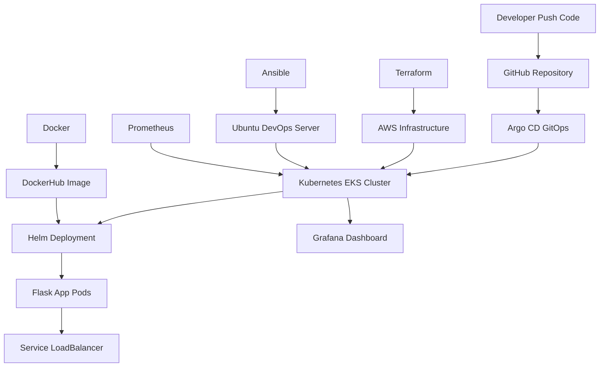

---

## 🔄 DevOps Workflow

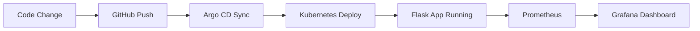

---

## ⚙️ Deployment Flow

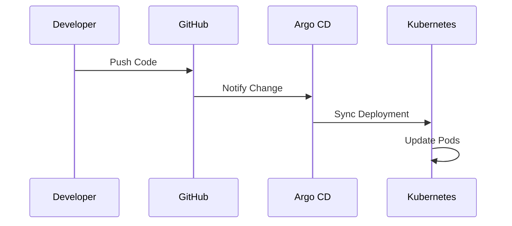

---

## 🛠️ Technologies Used

* AWS (EC2, EKS)
* Terraform (Infrastructure as Code)
* Ansible (Configuration Management)
* Docker (Containerization)
* Kubernetes (EKS)
* Helm (K8s Packaging)
* Prometheus & Grafana (Monitoring)
* Argo CD (GitOps)

---

## 📂 Project Structure

```text
end-to-end-devops-gitops-platform/
├── terraform/
├── ansible/
├── app/
├── helm/
│   └── flask-app/
├── argocd/
├── images/
├── README.md
└── .gitignore
```

---

## ⚙️ Step-by-Step Implementation

### 1️⃣ Infrastructure Provisioning (Terraform)

```bash
cd terraform
terraform init
terraform apply
```

---

### 2️⃣ Server Configuration (Ansible)

```bash
cd ansible
ansible-playbook -i inventory.ini playbook.yml
```

---

### 3️⃣ Docker Build & Push

```bash
docker buildx build \
  --platform linux/amd64 \
  -t minabisa90/devops-gitops-flask:v1 \
  --push .
```

---

### 4️⃣ Create Kubernetes Cluster

```bash
eksctl create cluster --name devops-gitops-eks
kubectl get nodes
```

---

### 5️⃣ Deploy Application (Helm)

```bash
helm install flask-app helm/flask-app
kubectl get pods
```

---

### 6️⃣ Monitoring Setup

```bash
helm install monitoring prometheus-community/kube-prometheus-stack -n monitoring
```

---

### 7️⃣ GitOps Deployment (Argo CD)

```bash
kubectl apply -f argocd/application.yaml
```

---

## 📸 Screenshots

### 🏗️ Terraform Infrastructure

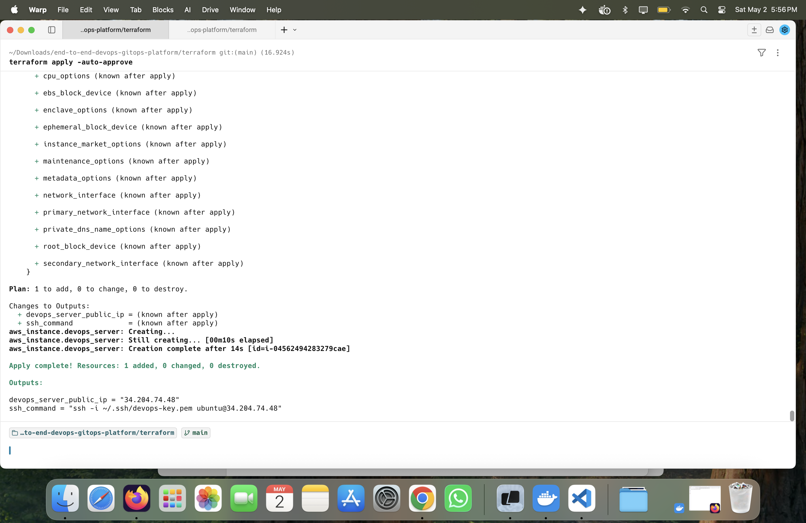

---

### ⚙️ Ansible Configuration

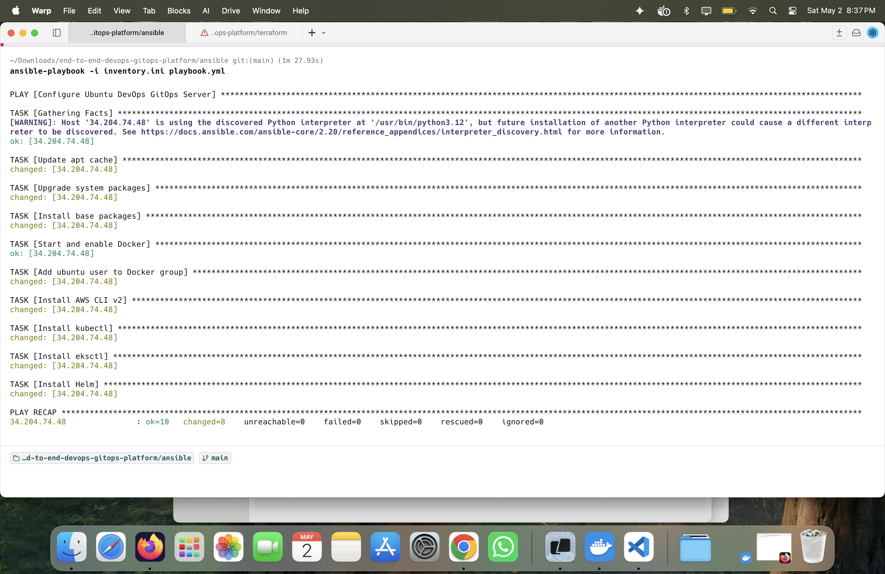

---

### 🐳 Docker Image (DockerHub)

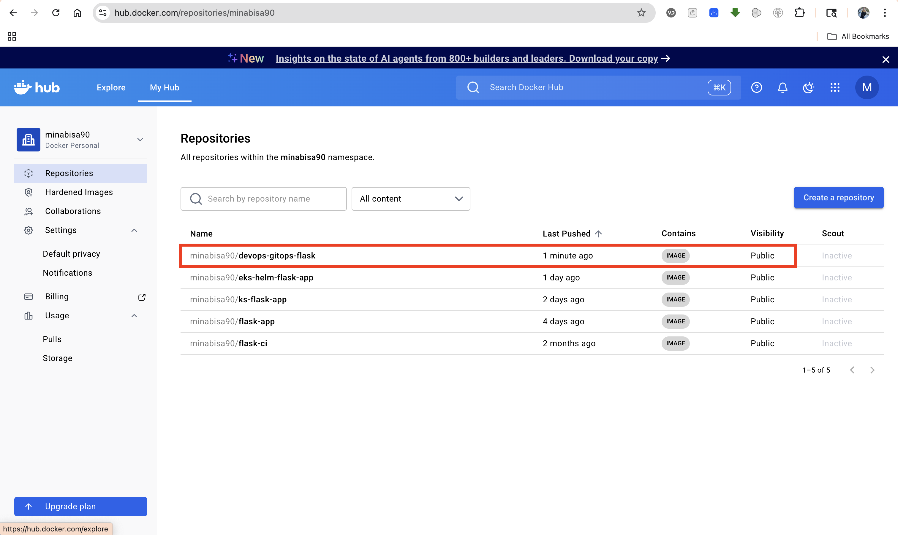

---

### ☁️ EKS Cluster Nodes

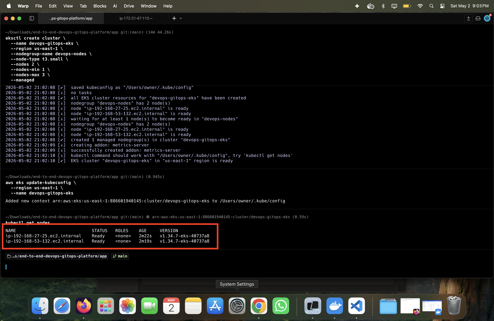

---

### 📦 Kubernetes Pods

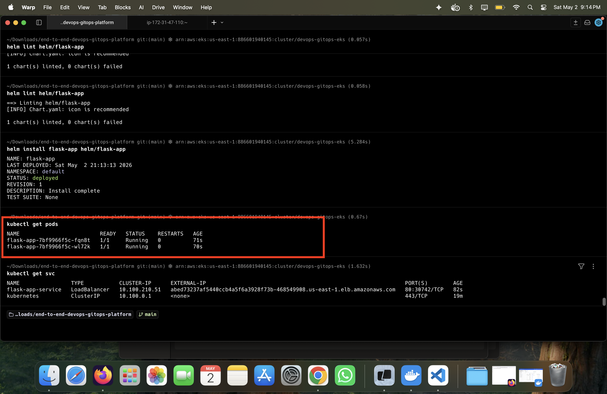

---

### 🌐 Service LoadBalancer

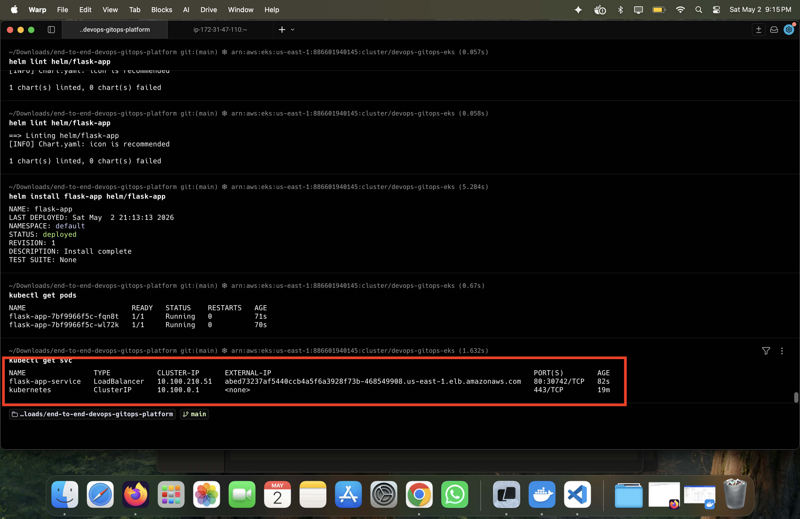

---

### 🚀 Application Running

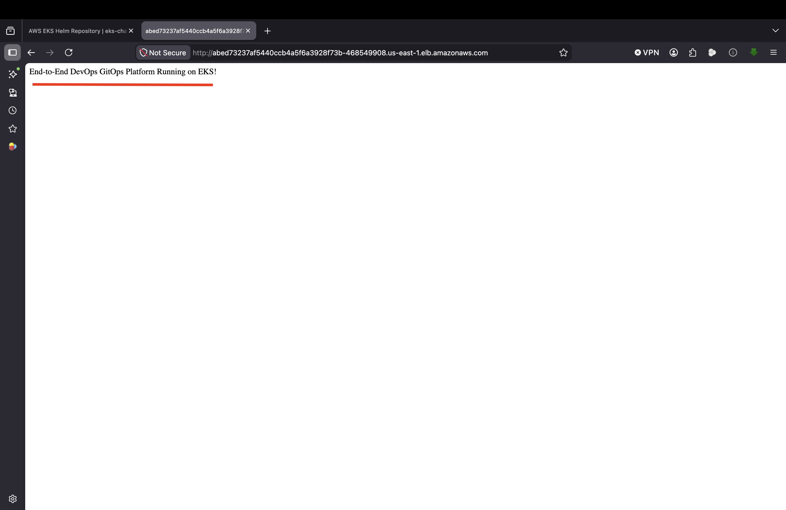

---

### 📊 Grafana Dashboard

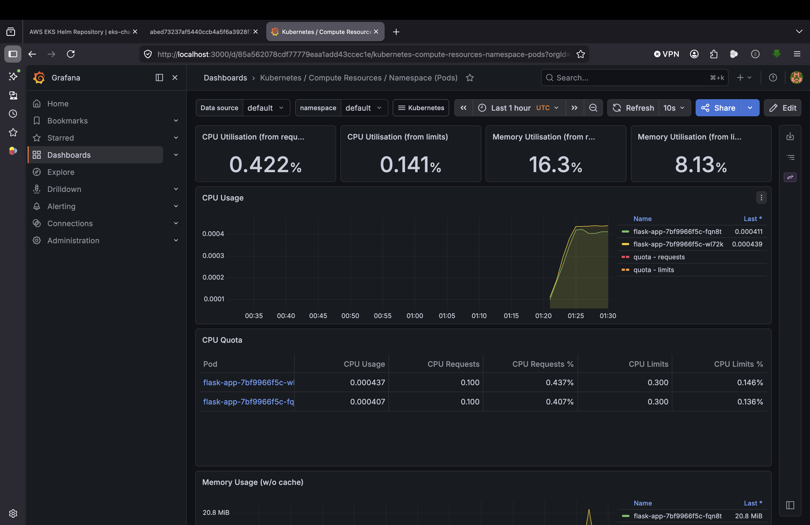

---

### 🔁 Argo CD GitOps Sync

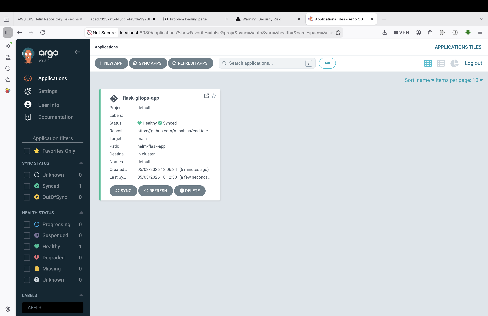

---

## 🔐 Best Practices Implemented

* Infrastructure as Code (Terraform)
* Configuration Automation (Ansible)
* Containerization (Docker)
* Kubernetes Declarative Deployment
* Helm Chart Packaging
* Monitoring & Observability
* GitOps Continuous Deployment

---

## 🎯 Key Learnings

* Built a full DevOps pipeline from scratch
* Automated infrastructure and deployments
* Deployed applications on Kubernetes (EKS)
* Implemented GitOps with Argo CD
* Integrated monitoring using Prometheus & Grafana

---

## 🚀 Future Improvements

* Add CI/CD (GitHub Actions or Jenkins)
* Add Kubernetes Ingress with AWS Load Balancer
* Implement auto-scaling (HPA)
* Secure secrets using AWS Secrets Manager

---

## 👨‍💻 Author

**Mina Bisa**

* GitHub: https://github.com/minabisa
* LinkedIn: https://www.linkedin.com/in/mina-bisa/

---

## ⭐ Support

If you like this project, give it a ⭐ on GitHub!

